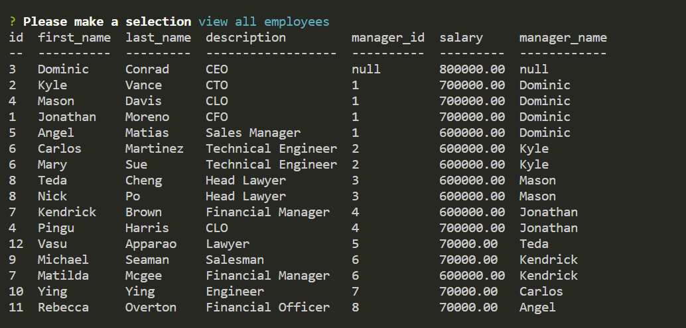

# SQL Employee Tracker

## Deployable Video Link
https://watch.screencastify.com/v/YEOnB4Y54mO8l2HNU5we

## Goal
The task was to make content management systems (CMS) that allow users to easily view and interact with information stored in databases in the command-line using Node.js, Inquirer, and MySQL.

## Technology Use
  - Javascript
  - JQuery
  - Node.js
  - Inquirer
  - Mysql2
  - Console.table
  - MySQL
  - VS Code
  - Git Bash 
  - GitHub

## Execution
The first part of making the sql employee tracker was to make a setup schema.sql, seeds.sql, index.js and gitignore files. After downloading the right versions of inquirer, Mysql2, Console.table, the tricky part was to make functions that would work with MySQL in order to generate the tables and information necessary to show in the command line. First thing to do when given a task of creating information from schema and seeds sql files into MySQL as seen below.

schema.sql code:
```SQL
DROP DATABASE IF EXISTS job_db;
CREATE DATABASE job_db;

USE job_db;

DROP TABLE IF EXISTS job_department;
CREATE TABLE job_department (
  id INT NOT NULL AUTO_INCREMENT PRIMARY KEY,
  name VARCHAR(30) NOT NULL
);

DROP TABLE IF EXISTS job_role;
CREATE TABLE job_role (
  id INT PRIMARY KEY AUTO_INCREMENT NOT NULL,
  department_id  INT,
  job_details TEXT,
  title VARCHAR(30),
  salary DECIMAL(8,2),
  FOREIGN KEY (department_id)
  REFERENCES job_department(id)
  ON DELETE SET NULL
);

DROP TABLE IF EXISTS job_employee;
CREATE TABLE job_employee (
  id INT PRIMARY KEY AUTO_INCREMENT NOT NULL,
  first_name VARCHAR(30),
  last_name VARCHAR(30),
  role_id  INT,
  manager_id  INT,
  FOREIGN KEY (role_id)
  REFERENCES job_role(id),
  FOREIGN KEY (manager_id)
  REFERENCES job_employee(id)
  ON DELETE SET NULL
);

```

seeds.sql code:

```SQL
INSERT INTO job_department (name)
VALUES ("Sales"),
       ("Engineering"),
       ("Finance"),
       ("Legal");

INSERT INTO job_role (title, salary, job_details, department_id)
VALUES ("CFO", 700000.00, "Head Sales Chief Guy", 1),
       ("CTO", 700000.00, "Head Engineer Guy", 2),
       ("CEO", 800000.00, "Main Guy", 3),
       ("CLO", 700000.00, "Head Legal Guy", 4),
       ("Sales Manager", 600000.00, "Assistant To CFO", 1),
       ("Technical Engineer", 600000.00, "Assistant To CTO", 2),
       ("Financial Manager", 600000.00, "Assistant To CEO", 3),
       ("Head Lawyer", 600000.00, "Assistant To CLO", 4),
       ("Salesman", 70000.00, "Employee in Sales", 1),
       ("Engineer", 70000.00, "Employee of Engineering", 2),
       ("Financial Officer", 70000.00, "Employee of Finance", 3),
       ("Lawyer", 70000.00, "Employee of Lawyer", 4);

INSERT INTO job_employee (first_name, last_name, role_id, manager_id)
VALUES ("Dominic", "Conrad", 3, NULL),
       ("Kyle", "Vance", 2, 1),
       ("Mason", "Davis", 4, 1),
       ("Jonathan", "Moreno", 1, 1),
       ("Teda", "Cheng", 8, 3),
       ("Kendrick", "Brown", 7, 4),
       ("Carlos", "Martinez", 6, 2),
       ("Angel", "Matias", 5, 1),
       ("Michael", "Seaman", 9, 6),
       ("Ying", "Ying", 10, 7),
       ("Rebecca", "Overton", 11, 8),
       ("Vasu", "Apparao", 12, 5);
```
After inputting the following sql files into the MySQL system, the next step was to put functions and prompts into the index.js file that would use MySQL's tables and generate it into the command line after the user inputs the information. The first step in accomplishing the task was to make require methods that pulled from their npm packages in order to generate questions and mysql info into tables like the ones below:
```Javascript
const inquirer = require('inquirer');
const mysql = require('mysql2');
const consoleTables = require('console.table')
```
The second part of tackling the employee tracker was to make questions using inquirer prompts used to generate the questions and user input into the command line. The follow code best represents this:
```Javascript
const initialPrompt = [{
    name: "initialQuestion",
    message: "Please make a selection",
    type: "list",
    choices: ["view all departments", "view all roles", "view all employees", "add a department", "add a role", "add an employee", "update an employee role", "exit application"]

}]
const newDepartment = [{
    name: "department",
    message: "Input department name",
    type: "input",

}]
const newRole = [{
    name: "name",
    message: "Input role name.",
    type: "input",

}, {
    name: "salary",
    message: "Input salary",
    type: "input",

}, {
    name: "assignDepartment",
    message: "Which department do you want to assign this role to?",
    type: "input",

}]
const newEmployee = [{
    name: "firstName",
    message: "Input employee first name.",
    type: "input",

}, {
    name: "lastName",
    message: "Input employee last name.",
    type: "input",

}, {
    name: "assignRole",
    message: "Which role do you want to assign this employee to? Numbers only",
    type: "input",


}, {
    name: "assignEmployeeManager",
    message: "Who is this employee's manager? Numbers only",
    type: "input",


}]
const clearRole = [{
    name: "first_name",
    message: "Input employee first name.",
    type: "input",

}, {
    name: "last_name",
    message: "Input employee last name.",
    type: "input",

}, {
    name: "role_id",
    message: "Which role do you want to assign this employee to? Numbers only",
    type: "input",

}]
```
After formatting the questions like the ones above, a switch case was made in order for the user to switch between questions in the command line. It is best represented with the code below:

```Javascript
function start() {
    inquirer.prompt(initialPrompt).then((response) => {
        switch (response.initialQuestion) {
            case "view all departments":
                departmentView()
                break;
            case "view all roles":
                roleView()
                break;
            case "view all employees":
                employeeView()
                break;
            case "add a department":
                addDepartment()

                break;
            case "add a role":
                roleSelect()

                break;
            case "add an employee":
                employeeSelect()

                break;

            case "update an employee role":
                updateRole()

                break;

            case "exit application":
                exitApp()

                break;
            default:

                return;
        }
    })
}
```
After making the switch case, functions that collected the information and functions that displayed the information were created in order to to generate tables based on user inputs.

All the functions that collect user input and the functions that displayed the information into tables is shown below:

```Javascript

function roleSelect() {
    inquirer.prompt(newRole).then((response) => {
        db.query('INSERT INTO job_role (title, salary, job_details, department_id) VALUES (?,?,?,(SELECT id FROM job_department WHERE name = ?))', [response.name, response.salary, response.job_details, response.assignDepartment], function (err, results) {
            if (err) {
                console.log(err)
            }
            console.table(results);
            start()

        })
    })
}


function employeeSelect() {
    inquirer.prompt(newEmployee).then((response) => {
            db.query(`INSERT INTO job_employee (first_name, last_name, role_id, manager_id) VALUES ("${response.firstName}","${response.lastName}","${response.assignRole}", "${response.assignEmployeeManager}")`, function (err, results) {
                if (err) {
                    console.log(err)
                }
                console.table(results);
                start()
            })
        }

    )
}

function addDepartment() {
    inquirer.prompt(newDepartment).then((response) => {
        db.query('INSERT INTO job_department (name) VALUES (?)', [response.department], function (err, results) {
            if (err) {
                console.log(err)
            }
            console.table(results);
            start()
        })
    })
}


function departmentView() {
    db.query('SELECT * FROM job_department', function (err, results) {
        console.table(results);
        start()
    })
}


function roleView() {
    db.query('SELECT job_role.id, job_role.title, job_role.salary, job_role.department_id, job_department.name FROM job_department JOIN job_role ON job_department.id = job_role.department_id ORDER BY job_role.id', function (err, results) {
        console.log()
        console.table(results);
        start()
    })
}


function employeeView() {
    db.query('SELECT job_employee.id, job_employee.first_name, job_employee.last_name, job_role.id, job_role.title AS description, job_employee.manager_id, job_role.salary, manager.first_name AS manager_name FROM job_employee JOIN job_role ON job_employee.role_id = job_role.id LEFT JOIN job_employee manager ON manager.id = job_employee.manager_id ORDER BY job_employee.manager_id', function (err, results) {
        console.table(results);
        start()
    })
}
 ```
The last two functions below allow the user to update the employee role and end the application respectively. the start() function on the last line initiates the questions. That code is show below:
 ```Javascript
function updateRole() {
    inquirer.prompt(clearRole).then(response => {
        console.log(response.role_id)
        console.log(response.first_name)
        console.log(response.last_name)
        db.query("UPDATE job_employee SET role_id = ? WHERE first_name = ? AND last_name = ?",[response.role_id, response.first_name, response.last_name], function (err, results) {
            console.table(results);
            start()
        })
    })


}


function exitApp() {
    process.exit()

}


start()
```
## Result

The following website demonstrates what the final product looks like:

The questions in command line


Department table


Job role table


Employee table

